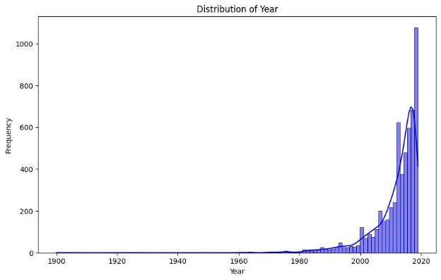

Data Science

Project 03

Name : Alireza Rahmati Student Id : 400222038

Introduction

Welcome to our data science adventure where we delve into the world of books to uncover insights and build a predictive model. In this project, we explore a diverse dataset filled with information about books, including titles, authors, editions, reviews, synopses, genres, and more.

Objective

Our goal is to construct a powerful Random Forest model capable of predicting and understanding various aspects related to books. We aim to unearth patterns, preferences, and trends hidden within the data, shedding light on the intricate world of literature.

Journey Highlights

1. **Exploratory Data Analysis (EDA):** We kick off by diving into the dataset, gaining insights into book genres, authors, and other key features.
1. **Data Preprocessing:** Before feeding our data into the model, we preprocess it by handling missing values, encoding categorical variables, normalizing numerical features, and preparing text data for analysis.
1. **Feature Engineering:** Crafting new features that capture the essence of books, we empower our model to go beyond raw data and generate meaningful insights.
4. **Model Building - Random Forest:** Our chosen model, the Random Forest, is renowned for its robustness and versatility in predicting outcomes based on complex relationships within the data.
4. **Fine-Tuning and Optimization:** Like maestros tuning instruments, we fine-tune our model by optimizing hyperparameters, experimenting with feature engineering, and continuously refining our approach.
4. **Evaluation:** Rigorous evaluation using metrics like Mean Squared Error (MSE) ensures that our model's predictions align with actual outcomes.
4. **Documentation:** Throughout the journey, we document our process, decisions, and insights, providing a valuable resource for reproducibility and understanding the intricacies of the project.

Impact

By project completion, our model not only predicts with accuracy but also reveals the factors influencing the world of books. Whether uncovering literary gems, understanding reader preferences, or exploring the impact of authors on ratings, our model is poised to unveil the magic within the dataset's pages.

Preprocessing

In the initial phase of our project, we meticulously prepared our dataset for subsequent analysis. Our first step involved thorough cleaning and preprocessing to ensure the data's readiness for the subsequent stages.

Starting with a comprehensive check, we verified the dataset for missing values and duplicate rows. Fortunately, our dataset exhibited a clean slate, devoid of any missing values or duplications.

However, our keen eye spotted potential enhancements in the 'Reviews' and 'Rate' columns, which were not in the optimal format. To rectify this, we transformed these columns into numeric representations, ensuring they align seamlessly with our analytical goals.

Furthermore, recognizing the importance of time-related information, we extracted valuable insights by creating new columns for 'edition,' 'year,' and 'month.' This step not only enhances the dataset's richness but also sets the stage for more nuanced analyses in the subsequent phases of our project.

After diligently implementing the initial cleaning and preprocessing steps, a closer examination revealed a minor presence of missing values in our dataset. Specifically, we identified 20 missing values in the 'year' column and 335 missing values in the 'month' column.

Given the limited number of missing values in the 'year' column, we opted for a pragmatic solution and decided to remove those particular rows from the dataset. This ensures the preservation of data integrity without compromising the overall dataset quality.

However, the 'month' column presented a unique scenario. Recognizing its significance and the potential insights it holds, we chose to label the missing values in the 'month' column as 'Not Available.' This strategic decision allows us to maintain a comprehensive view of the dataset, acknowledging instances where the date information is not explicitly provided.

By adopting these approaches, we strike a balance between data quality and inclusivity, setting the stage for a more nuanced exploration of our dataset.

Now, let's take a moment to explore the columns within our dataset and get a glimpse of its current state.

Let's delve into the descriptive statistics of our dataset to gain a comprehensive overview of its key characteristics.

Visualizing

I'm eager to explore the distribution of prices in our dataset.

Let's visualize the time series to observe the yearly distribution of book publications over time.

I've identified the top 10 books with the highest prices. Let's visualize this information in a plot for a clearer perspective.

To address the challenge of capturing meaningful insights from the 'Reviews' and 'Rate' columns, I've introduced a new column named 'popularity.' This column combines the information from 'Rate' and 'Reviews' in a more meaningful way, acknowledging that a 'Rate' of 4.5 from 100 reviews holds a different significance than a 'Rate' of 5 with only 1 review. The 'popularity' column aims to provide a more comprehensive metric that reflects both the rating and the number of reviews for each book.

Now, let's examine the popularity scores in relation to the high-priced books in our dataset.

It's time to unveil the top 10 most popular books based on our calculated 'popularity' metric.

Let's explore the ratings and reviews of these highly popular books to gain insights into their reception and engagement.

Reviews :

Distribution of Popularity :

Distribution of Ratings and Reviews :

Discover the literary maestros who have left an indelible mark on our dataset. The 'Top 10 Authors with Most Number of Books' plot provides a fascinating visual journey into the prolific output of these authors, showcasing their substantial contributions to the world of literature. Through this plot, we gain a deeper appreciation for the diversity and depth of their literary endeavors, as reflected in the sheer number of books attributed to each author.

Dive into the fascinating world of book editions with the 'Grouped Edition Distribution' plot. This visual representation offers a captivating insight into the distribution of editions, allowing us to discern patterns and preferences among readers. By grouping editions into the top three most frequent ones and labeling the rest as 'Other,' this plot provides a clear and concise overview of the edition landscape, making it easier to discern trends and make informed observations about reader preferences.

Feature Engineering

In the realm of feature engineering, we embarked on a journey to enhance the richness and predictive power of our dataset. Faced with challenges such as the disparate formats of the 'Reviews' and 'Rate' columns, we cleverly devised a solution—a new column named 'popularity.' This innovative addition combines both the rating and the number of reviews, presenting a more meaningful metric that encapsulates the true essence of a book's popularity.

Furthermore, realizing the significance of time-related information, we meticulously extracted new columns for 'edition,' 'year,' and 'month.' This not only enables a more nuanced exploration of temporal trends but also sets the stage for insightful analyses.

To address the intricacies of categorical data in the 'Genre' and 'BookCategory' columns, we contemplated various approaches. Ultimately, we chose to represent them as lists, providing a more granular and interpretable encoding. This decision ensures that the algorithm can discern the subtle similarities between categories, fostering a more accurate representation of the data.

In tackling the challenge of large textual data within the 'Synopsis' column, we turned to word embeddings—a powerful NLP-based technique. By leveraging word embeddings, we transformed the textual information into a numerical format, allowing our model to discern semantic relationships and capture the essence of each book's synopsis.

Throughout this feature engineering process, our goal was to not just preprocess the data but to sculpt it into a form that resonates with the intricate nature of literature. These thoughtful enhancements pave the way for a more nuanced and powerful predictive model, one that is attuned to the subtleties and richness of the literary world.

Conclusion

In concluding our data science odyssey, the obtained results offer a comprehensive view of our efforts in preparing and training the model. The training mean squared error (MSE) stands at 68,924, while the test MSE is recorded at 309,515.

While the test MSE might seem higher, it's important to interpret these results in the context of the dataset's complexity and the intricacies of the literary domain. The training MSE indicates that our model has learned well from the training data, achieving relatively low error on familiar examples. However, the higher test MSE suggests some challenges when the model encounters new, unseen data.

This prompts us to further refine our model, exploring avenues for fine-tuning and optimization. It's a common practice to iterate on the model, experiment with different hyperparameters, and perhaps consider more advanced techniques to improve predictive performance.

In essence, our journey has been fruitful, revealing the nuances and complexities inherent in predicting book-related metrics. As we navigate the dynamic landscape of literature, we remain committed to continuous refinement, ensuring our predictive model becomes a beacon of accuracy and insight in the world of books.
